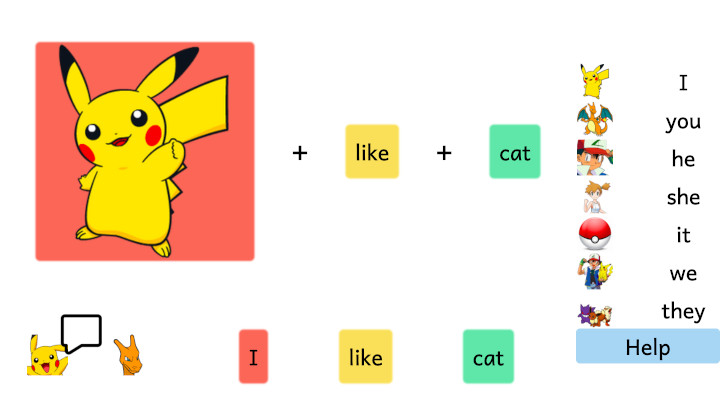

# [Pokemon Pronouns](https://teflassistant.com/pokemon-pronouns/)
Practice your pronouns with Pikachu's help.

## Purpose/Goal
To recreate a lesson that one of my Japanese teachers of English does every year. I really liked his style and wanted to make a digital tool to complement it.

## Operation
There are instructions on how to use app which you can get to by clicking the "Help" button, but here is a summary;  
Pikachu is talking to Charizard using simple Subject-Verb-Object, 3-word sentences.
* Top sentence
    * The sentence on top is the example that the teacher uses to test the students' knowledge by eliciting responses.
    * Click on the characters on the right to change the subject's image (I, you, he, she, it, we, they) indicated by a red background in the sentence.
    * Click on the verb  (yellow background) to cycle through the base-verb choices.
    * Click on the object (green background) to cycle through the object choices.
* Bottom sentence
    * Regardless of the changes to the subject in the top sentence, the subject will always go to the correct answer.
    * The verb will always go to the correct form of the verb chosen in the top sentence so that it fits with the chosen pronoun.
    * The object will cycle through 3 choices to allow the teacher to explain the subtle differences between the singular and plural forms which are a common sticking point for students.

## Tech/Libraries Used
* HTML
* CSS
* JavaScript
* React

## Problems/Solutions
My Japanese is not perfect, but I was able to consult with the other teachers to find a translation that would be easy to understand for teachers and students alike.

## More Information
This app is meant to be used on large screens like laptops, desktops and digital whiteboards. Later, I will adapt it for small screens (May 24th, 2020).
